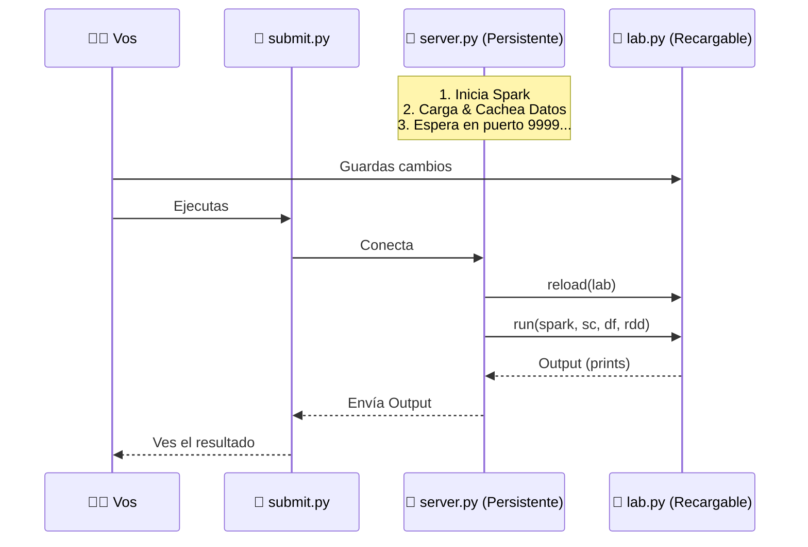

# Spark Loader

Un entorno de ejecución ultra-rápido para PySpark que mantiene los datos en memoria y recarga tu código al vuelo.

## Quick Start 🚀

### 1. Levantar el Servidor
Construye la imagen y espera a que Spark esté listo:

```bash
docker-compose up --build --wait -d
```

### 2. Ejecutar tu Código
Corre el script que le avisa al servidor que procese `lab.py`:

```bash
docker exec -it spark python3 submit.py
```

## 📂 Archivos Importantes

Todo lo que tenés que tocar está en la carpeta `dataset/`:

*   **`dataset/lab.py`**: **¡EDITÁ ESTE ARCHIVO!** Acá escribís tu lógica de PySpark.
*   **`dataset/`**: Poné tus archivos de datos (CSVs, TXTs) acá.
    *   *Nota*: Desde el código, accedés a estos archivos en `/bases/` (ej: `/bases/data.csv`).

---

## ¿Cómo funciona?

El sistema separa la **carga de datos** de la **lógica de análisis**:

1.  **`server.py` (El Motor)**: Arranca Spark, carga el CSV en un DataFrame/RDD y los deja en caché. Luego se queda escuchando en el puerto `9999`.
2.  **`lab.py` (Tu Código)**: Acá escribís tu lógica. El servidor recarga este archivo cada vez que lo llamás, inyectándole las variables `spark`, `sc`, `df` y `rdd` ya listas.
3.  **`submit.py` (El Gatillo)**: Se conecta al servidor y le dice "¡Ejecutá ahora!". Recibe la salida y te la muestra.

## Flujo de Ejecución 🔄



## Comentarios Importantes

*   **No reinicies Docker**: La gracia es que Spark siga corriendo. Solo editá `lab.py` y corré `submit.py`.
*   **Variables Disponibles**: En `lab.py` ya tenés:
    *   `spark`: La sesión de Spark.
    *   `sc`: El contexto de Spark.
    *   `df`: El DataFrame con tus datos cargados.
    *   `rdd`: El RDD con tus datos cargados.
*   **Manejo de Errores**: Si tu código falla, el servidor atrapa la excepción y te muestra el traceback sin crashear el contenedor.
